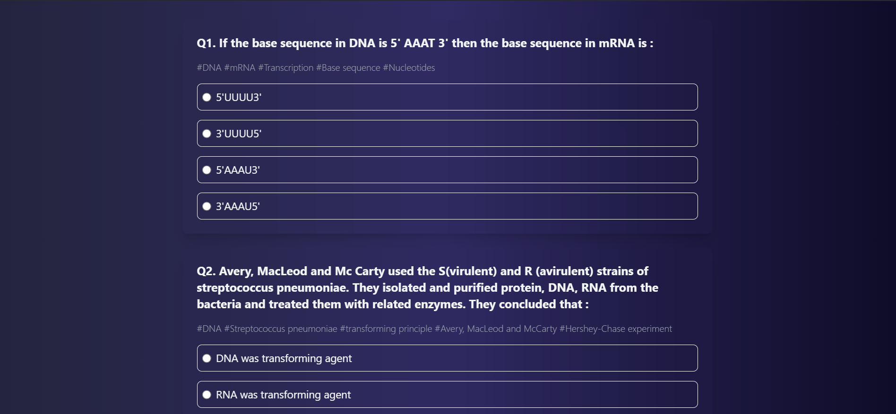
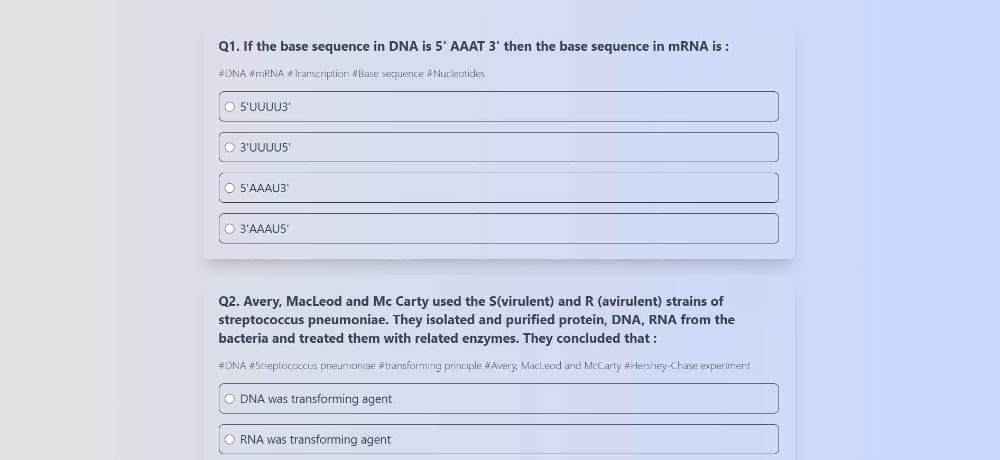
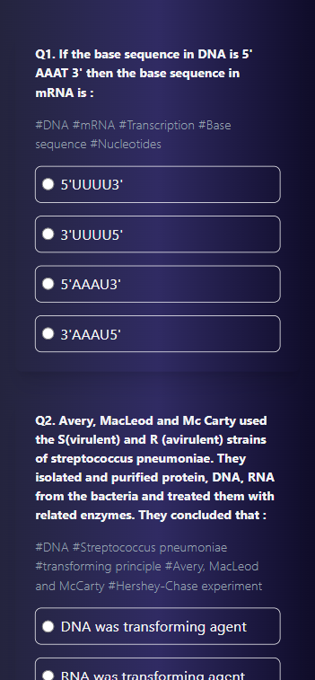

# Quiz Application

This is a React-based quiz application that allows users to take a quiz, select answers, and view detailed solutions for each question. The app features confetti effects upon quiz completion, shows answers, and provides a clean and responsive design using Tailwind CSS.

 



[Download the video](./assets/videos/Screen%20Recording%202025-02-02%20013157.mp4)


## Features

- **Dynamic Question Rendering**: Questions and options are fetched from a central store and displayed dynamically.
- **Option Selection**: Users can select answers from the given options for each question.
- **Quiz Submission**: Once the quiz is completed, users can submit their answers and view their score.
- **Detailed Solutions**: After submission, users can toggle visibility for detailed solutions for each question.
- **Confetti Effect**: A fun confetti animation is shown if the user's score is greater than 7.
- **Responsive Design**: The app is fully responsive and works well on all screen sizes.
- **Dark Mode Support**: The app supports both dark and light modes, with automatic styling adjustments.

## Installation

To run the quiz application locally on your machine, follow these steps:

1. **Clone the repository**:
   ```bash
   git clone https://github.com/chandradiproy/quiz-app

2. **Navigate into the project directory**:
    ```
    cd quiz-app
3. **Install dependencies**:
    ```
    npm install
4. **Start the development server**:
    ```
    npm start

## Usage
Once the application is loaded:
1. Click the "Start" button to begin the quiz.
2. Select an answer for each question.
3. After completing all the questions, click "Submit Quiz" to view your score.
4. If your score is high enough, enjoy the confetti effect!
5. You can also toggle the visibility of detailed solutions for each question by clicking "Show Answer."

## Technologies Used
- React: The core library for building the user interface.
- Tailwind CSS: Utility-first CSS framework for styling and responsive design.
- React Confetti: A library used to create the confetti effect upon quiz completion.
- Lucide Icons: A collection of open-source SVG icons.
- React Markdown: To render Markdown content for displaying detailed solutions.
- React-Use: A collection of hooks, used here for window resizing.

## File Structure
```
    .
    ├── public/
    │   ├── index.html
    ├── src/
    │   ├── components/
    │   │   ├── Quiz.js
    │   ├── store/
    │   │   ├── quiz.store.js
    │   ├── App.jsx
    │   ├── main.jsx
    |   ├── index.css
    ├── index.html
    ├── vite.config.js
    ├── package.json
    ├── README.md
```

## Code Structure

- `App.jsx`: The main entry point for the application. Contains the structure for the quiz.
- `Quiz.jsx`: The main quiz component that manages the display of questions and handles logic for option selection and quiz submission.
- `quiz.store.js`: Manages the state related to the quiz, such as questions, score, and selected options.


